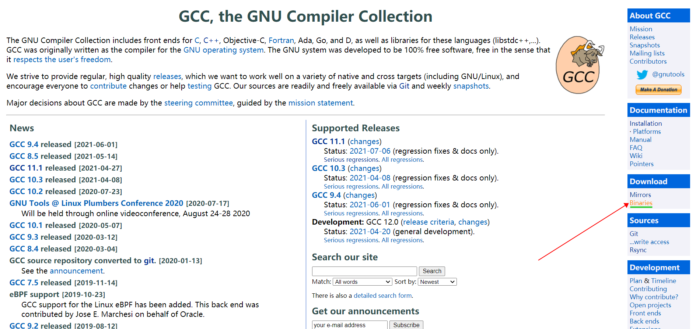
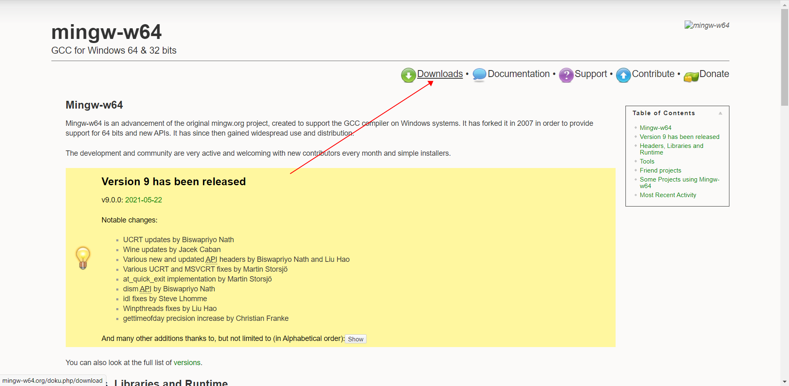
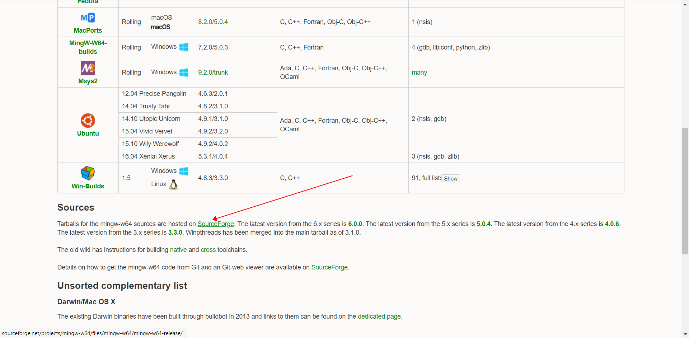
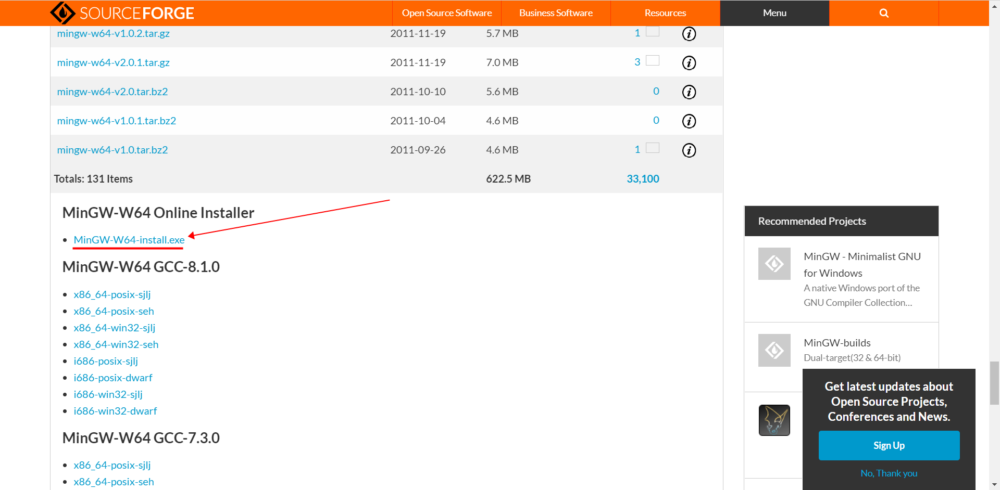
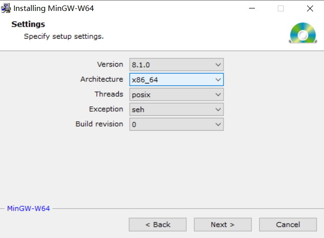

GCC, the GNU Compiler Collection - GNU Project - Free Software Foundation (FSF)

MinGW-w64 - for 32 and 64 bit Windows - Browse /mingw-w64/mingw-w64-release at SourceForge.net

mingw-w64 源的包托管在SourceForge 上，我们选择下载 MinGW-W64-install.exe

---
[mingw download link](https://www.gnu.org/software/gcc/)

---

---

---

---

---

---

② 安装

③ 配置环境变量
在 mingw-w64 安装目录中，寻找 g++.exe 所在的文件夹，复制 g++.exe 所在的文件夹的地址，将它添加到系统的环境变量 Path 中，我们就完成全部的配置了。

比如，我的 g++.exe 所在的文件夹地址：

>C:\Program Files\mingw-w64\x86_64-8.1.0-posix-seh-rt_v6-rev0\mingw64\bin
